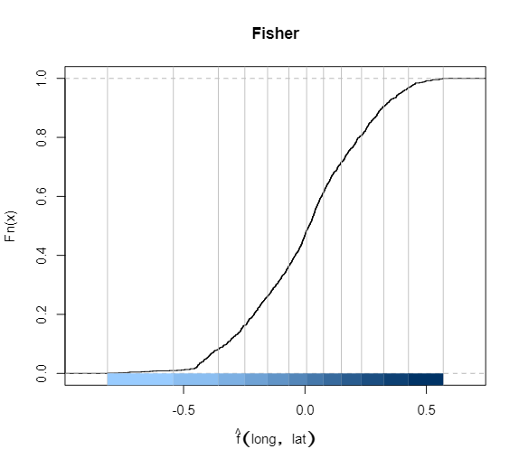
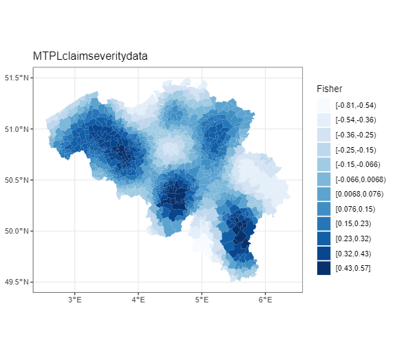
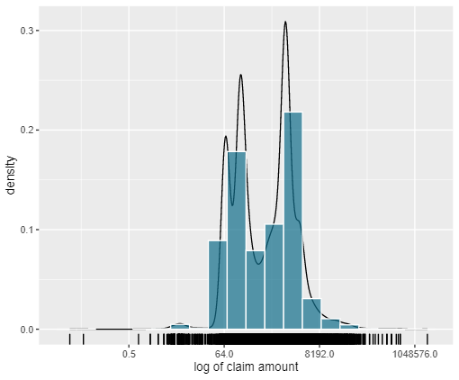
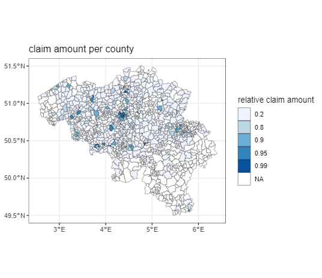
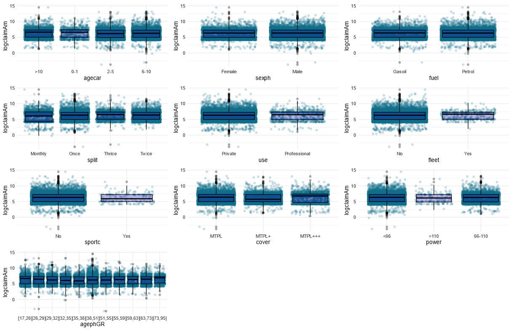
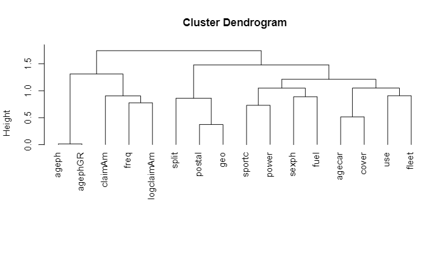

\tableofcontents
\pagebreak

# Introduction

## Binning of Spatial Data 
Spatial data was represented as a pair of coordinates in the dataset. These correspond to the center of each of the Belgian cities. In this way they could be linked to the postal codes, which is a known variable for each policy holder in the dataset. This allows us to make predictions of the claim frequency and claim severity based on the city that a policy holder lives in. Then based on these predictions the postal codes can be binned in an optimal number of factors. 

To start, a model to estimate the predicted frequency and severity needs to be constructed. A Generalized Additive Model will be used for this purpose. A base model to model spatial data is $y ~ s(long, lat, bs=”tp”)$. From here on, there will be differences between frequency and severity because they will each have their own optimal GAM-model, based on different dataset. Frequency used all observations, while the severity dataset makes abstraction of policy holders that did not file a claim in the observation period. Note that a smoother was used for longitude and latitude coordinates, which makes us able to see regions with higher expected claim frequency or expected claim amount. If only postal codes were used, these regional effect would not be visible and all cities would be seen as independent of their location with respect to each other. 

For frequency, we use a Poisson-family with a log-link function which is a logical choice when modeling claim frequency in an insurance context. Also, the exposure needs to be added as an offset due to a not all policy holders being covered for a full year and due to modifications (eg. people that move change their postal code, people that buy a more powerfull car). The spatial model is then extended with different other variates. By comparing the log-likelihood and the Akaiki Information Criterion (AIC) of different GAM-models, the most optimal GAM for frequency data was found:$ freq ~ s(ageph) + s(long,lat) + power + cover + fleet + split  + fuel + sexph + agecar$. Also, this model was constructed with a Restricted Maximum Likelihood (REML), while still applying the offset and the same family and linkfunction. 

The Gamma distribution with a log-link function is chosen in severity modeling for two main reasons. First, the claim amounts range corresponds well with the Gamma distributions interval which is bounded on the positive numbers. Second, the Gamma-family is a  flexible which can easily adept to the empirical distribution of the sample. The steps taken are the same as in the frequency's case. 

These models were then used to predict the expected claim frequency and amount per city. On a continuous scale, this would yield results presented in the following map of Belgium:

Linking each policy holder’s postal code to its predicted frequency and amount, makes us able to bin the continuous variable using Fisher’s method. This method bins based on the steepness of the cumulative distribution function of the predicted values. 

A follow-up problem of binning is choosing the optimal number of bins over which the observations need to be distributed. By comparing the BIC’s, for frequency modelling 11 bins came out to be optimal. This yields a factor variable that approximates the continuous spatial variables. The factor variable is added to the dataset to be used in further modelling. 

The optimal amount of bins for ageph in severity was twelve. This has been found using the dame approach as in the frequency case and is also added to the dataset of severity. 

{width=50%}
{width=50%}

??????????????

## Binning of Age Variable 

In the dataset used to price our insurance products, age is recorded as a continuous variable with ages ranging from 17 to 95 years old. To optimally use a GLM, it is advised to use only categorical variables, and thus age is best converted to an ordered factor variable. Again, because there is a difference in the used dataset for frequency and severity modelling, the breakpoints may differ. 

For claim frequency, the GAM-model used for the binning of spatial data was reused, but with the binned version of the spatial data as a replacement for its continuous counterpart. All other aspects identical. So the used formula is: $freq ~ s(ageph) + geo + power + cover + fleet + split + fuel + sexph + agecar$, with ‘geo’ being the binned spatial variable. By predicting the claim frequency and constructing a new dataset (GAM_data) where the observations are counted per value of age. This is possible because ‘age’ is not really a continuous variable, it can only take positive integer values. In this dataset, the coefficient of the smoother of ‘age’ is also included. Based on GAM_data, the evtree( )-function in R can be used to construct a regression tree based on an evolutionary algorithm and with the counts per age as weights. In this function, it is usefull to include an evtree.control( ), which controls the complexity of the constructed tree. 4 Parameters were used for this goal, with the first being the alpha, which was set to 100. Also, the maximum depth of the tree was set to 5 to control the size of the tree. The two last control parameters were set to control the choice of splitting or not. ‘minbucket’ Sets the minimum sum of weights in a terminal note, here set to 5% of the total weights in the training set. ‘minsplit’ Determines the needed minimum sum of weights in a node to consider a split, here set to 10% of the total weights in the training set. 

The constructed tree yields the following breakpoints: 17, 26, 29, 32, 35, 38, 51, 55, 59, 63, 73, 95, which makes for 11 bins. This tree can also be graphed: 

Clearly, the differences in expected claim frequency per bin can be seen in the boxplots below each bin in the tree. Policy holders younger than 26yo have a higher expected claim frequency compared to for example a 55yo policy holder. The binned variable is added to the original dataset under ‘agephGR’. 

For Severity the same approach has been adopted as in Frequency. 
????????????

## Exploratory Analysis 

### Frequency

### Severity 

we started the exploratory analysis on the severity by looking at the density of logarithmic claim amounts. From the density we can clearly see that the data is not following any well-behaved distribution and we thus opted for using the gamma distributions as this distribution is more versatile than the log-normal. From the graph we can also deduct that there are a lot of outliers, which is expected for claim amounts as they tend to deviate from the mean. Next, the mean, variance, skewness and kurtosis are 1866.57, 19338.67, 78.84, 7701.894 respectively. This also indicated a lot of deviation on the positive side and frequent outliers as the kurtosis is substantial. This result also emphasize the conclusion we made from the graph. The following figure is a representation of the relative claim amounts per county where we subdivide the claim amounts per county according to the following quantiles: 0.2, 0.8 , 0.9, 0.95 and 0.99 .  From the map of Belgium we can say that most of the claim amounts occur in the cities like Brussels, Antwerp and Liege. Although, there are some counties where the claim amount is also a sizable amount, for example in the Hainaut Province. This probably indicates that some outliers might be located in these regions. 

{width=50%}
{width=50%}

Now that the claim amounts have been plotted according to the postal codes, we can subsequently plot the claim amounts based on the other independent variables. Here it is clearly visible that there are some variables which could be redundant and thus have less explanatory power than the others. For example the variables use, fleet and sport car are highly homogeneous and likely not able to explain a lot of the variation in our depended variable. Also, the variables sex, fuel and power do not have a visible impact on claim amounts. On the other hand, the variables age of the car, cover, split and the binned version of policy holders age create a detectable change in the claim amounts and will thus be more likely to explain our depend variable. Note, that the outliers are primarly located in cars with six to ten years of age from males between 38 and 51 having a one time split of the premium with a MTPL cover. But we also need to be carefull of this explaination as this is also the largest subgroup in the population and might as well just posses these outliers in proportion. 

{width=100%}

## Interaction Effects

Now that we have looked at the independent variables with respect to the dependent variable we want to have a closer look at the interaction effects between the independent variables. To do this we follow the paper of @chavent2011clustofvar. @chavent2011clustofvar measured the homogeneity between variables by looking at the squared Pearson correlation $r^2$  and the correlation ratio $\eta^2$ between the variables. They defined the homogeneity of a cluster of variables $C_k$ as: 

$$ H(C_k) = \sum_{x_j \in C_k} r^2_{x_j,y_k} + \sum_{z_j \in  C_k} \eta_{y_k|z_j} = \lambda^k$$
Where $x_j$ are the quantitative variables,  $z_j$ are the qualitative variables and $y_k$ is the first principle component (PCA) of the cluster ( or the synthetic variable of the cluster). Then, @chavent2011clustofvar deviced an algorithm which chooses the partition which maximizes the homogeneity of the cluster. This is done in nested approach giving us the dendograms below. 

The interaction between the variables is shown in the dendogram. Clearly, ‘sportc’ and ‘power’ are closely linked, which can perfectly be explained by the logic that sportscars mostly have a more powerfull engine. Also the stronger correlation between the age of the car and the type of cover can be explained: most newer cars have an MTPL-coverage, while older cars tend to go for MTPL+ or MTPL+++. Next, the link between ‘use’ and ‘fleet’ can be explained by the fact that most professional-use cars are company cars which are part of a fleet. Lastly, an interaction between the age of the policyholder and the payment method (‘split’) is studied based on the logic that younger people prefer to split their premium payments due to them having less money to spend compared to older people. Although, looking at the graph, this relation is not observable in the data. Note that our depended variable is also included and we can already see which variables might be important in explaining the claim size. For claim amount 'ageph' , 'split' and 'geo' will probably have an significant impact.

{width=75%}

# Model Building 

## Frequency 

Frequency analysis will be done using two models. On the one hand a Generalized Linear Model and on the other hand a Gradient Boosting Machine. Both will be compared whether they have sufficient predictive power, given their complexity. The final model will be chosen based on the higher accuracy on unseen data, while maintaining a model as simple as possible. Note a GLM is much simpler compared to a GBM, but is a lot less flexible.

### Generalized Linear Model (GLM)

A GLM was chosen because it is one of the most interpretable models of all possible models, which is very important when explainability is an important factor as it is in the insurance industry. A simple model is easy to explain to the legislator and other stakeholders who may not be an expert in this field. As already mentioned, a GLM is not the most flexible model with respect to other models. It requires linear relations and is preferably modelled with categorical independent variables. Because of this the spatial variable and the variable of the age of the policyholder were binned into two factor variables, as discussed earlier. 

To find the optimal GLM, the simplest possible model was used as a starting point: freq ~ 1. Because Poisson is a good distribution for frequency data, the Poisson family was used when constructing GLM’s with the logarithm of exposure as an offset to correct for non-full years of coverage. On this base case, other variables were added one by one and their drop in deviance was compared. The added variable which constituted the biggest drop in deviance, given this drop was significant compared to a Chisq. critical value, was kept. Once all singular variables were exhausted, interaction terms were considered, limited to two-way interactions. Not all possible interactions were tested, but only the logical ones and the ones based on a Dendogram (see Interaction Effects). 

In the added Excel-file (tab ‘GLM’), the reader can follow and compare all the added variables in each step. As an example, the first box is added which is used to find the first variable to add to the model. The first line is the base case (glm0), respresented by the formula   freq ~ 1, with a deviance of 72.239 and 130.926 degrees of freedom. Each line in the second box represents a different added variable. Every model has its own deviance and degrees of freedom. By comparing these with the base case, the model with the biggest drop in deviance can be selected. In this case adding ‘agephGR’ gives the biggest significant drop in deviance, while ‘use’ gives the smallest. The p-values of each added variable were calculated using the Chi-squared distribution. Following these findings, the model to proceed with is $freq ~ 1 + agephGR$, which will be used as the new base case for adding a second variable. 

Applying this method repeatedly it can be shown that the most optimal GLM, given the observed training dataset is: 

As a last check whether the aded variables are indeed significant and meaningful, the optimal GLM is compared to the initial base case (glm0). The output below (anova with Chi-squared test) shows a drop in deviance of 2163,7, a difference of 37 degrees of freedom which lead to a p-value small enough to make almost-certain conclusions (***). $(add output of anova(glm0,glm_opt))$

### Gradient Boosting MAchine (GBM)

A second approach to modelling frequency data, was by applying a Gradient Boosting Machine. Gradient Boosting is a machine learning technique for regression and classification problems to build a predictive model as an ensemble of weak predictive models. It builds sequential models, in contrast to random forest which builds in parallel, and optimizes an arbitrary differentiable loss function @hastie2009elements. This differentiable loss function is the Poisson deviance for this application, due to it being used widely when modelling claim frequency. In short, GBM combines weak learners into a single strong learner in an iterative way. By doing this, the model becomes rather flexibel compared to simpler models as a GLM. But this approach has a much lower interpretability and explainability. Just imagine having to provide every tree in the sequence to explain why a certain prediction comes about. Obviously this is much harder than just offering a Least Squares model that can be interpreted by almost anyone with basic statistical knowledge.

Gradient Boosting has two tuning paramters which need to be optimized. On the one hand the number of sequential trees (n.trees, T) needs to be determined, and on the other hand the interaction depth (interaction.depth, d) needs to be determined. T is rather self explanatory in the sense that more trees make for a complexer, but a more flexible model. The interaction depth might need some added explanation. When d is 1, an additive model is made. When d is 2, the algorithm allows up to two-way interaction. Also, note that when d increases, the complexity of the model will also increase.

Besides tuning parameters, also two hyperparameters need a value assigned to them. Firstly a shrinkage paramter (0<λ<1) needs to be assigned, which determines the learning rate or step-size reduction of each iterative tree. Assigning a higher value to this parameter will result in better performance, but will also increase the number of trees and thus increase the computational time. For this application, a value of 0,01 is used based on the finding of Henckaerts et al. $(SOURCE, paper Roel)$. The second hyperparameter also is based on the finding of this same paper, namely the bag fraction (0<δ<1), which gets the value 0,75 assigned to it. This means that in each iteration 75% of the training set is randomly selected and used to determine the following step. By introducing randomness, it is usefull to set a seed in R so that the results can be reproduced. Another choice that has to be made before modelling is the number of folds in the cross-validation (cv) of the GBM. Tests have been conducted with cv set to 5 and 10, but the added computational cost of a 10-fold cross-validation was not worth the marginal gain in accuracy $(link to second tab of Excel file)$. Because of this reason a 5-fold CV was deemed to be sufficient. Lastly, there was opted to set the minimum amount of observations in a terminal node equal to 10.000 to set a certain constrain on the size and complexity of the model. 

All chosen parameters can be found in the arguments of the gbm( )-function in R:

(ADD CODE gbm_0 - Line 24 GBM)

The results for different values of ‘interaction.depth’ and ‘n.trees’ were conventiently summarized in a table. To optimize the numbers of iterative trees two methods were used. First the out-of-bag estimate was calculated and secondly cross-validation was used. Although the OOB-method gives a warning of underestimation in R, there was opted to proceed using the findings of this method. 

Note in the table that an increase of the interaction depth from d = 2 to d = 3 does not significantly decrease the training error, while this change increases the complexity by quite a bit. The training error is calculated on the last iteration in the model, being the value of n.trees. Comparing the values of OOB n.trees for d = 2 and cv = 5, yields an optimal GBM with d = 2 and n.trees = 681 as shown in the graphs of the Poisson deviance and the change in this deviance.
 

(ADD CODE gbm_perf - Line 170 GBM)

 

Using the optimal Gradient Boosted model (gbm_perf), partial dependence plots can be constructed. These depict the functional relationship between an input variable and the predictions and they show how predictions depend on these inputs individually. In this way the relevance of different input varaibles can be determined. The PDP’s of all individual variables of the optimal GBM are tabulated below. From these, it is clear that ‘geo’, ‘ageph’, ’agecar’, ’sexph’, ’fuel’, ’split’, ’cover’ and ‘power’ have a significant influence on the predictions made. In contrast, ‘use’, ‘fleet’ and ‘sportc’ do not have this important role when predicting claim frequency.  Although a certain comment has to be made with respect to these last three variables. When looking at the relative frequency of these three variables, it is clear that there were only very few observations of sportscars, professional use cars and cars that were part of a fleet. This could be a (partial) explanation of the findings of an insignificant influence. 

### Conclusion 

Two models were contructed and optimized, a GLM on the one hand and a GBM on the other hand. Both of these models serve a predictive models for claim frequency, and both yield satisfactory results. Although, one of both has to be chosen. This choice will be based on predictive power and complexity of the model. In this stage the test set will be put to use, which is the dataset with unseen data for both models. Based on the predictive power on this set, the right model will be chosen. Predictive power is measured with the Root Mean Squared Error (RMSE) and the calculations are shown below.

$$RMSE = \sqrt{\frac{1}{n}\sum(\hat y_i - y_i)^2} $$

Notice that the RMSE of the test set is comparable for both models with only marginal differences. With these findings in mind, there can be concluded that the optimal GLM is the model to use. This because the RMSE’s are so close to each other that the added complexity of the optimal GBM just is not worth it. As a conclusion of frequency modelling, to final model will be repeated below:

## Severity 
For modeling the severity, we opted for a GLM and a Random Forest. This chose was based on the fact that GLMs are still the most interpretable models currently available and thus a good way to give meaning to the results. The Random Forest was chosen because they require no fine tuning like GBM and are thus less susceptible to overfitting, which in the severity case might be better to avoid. 
 
### Generlized Linear Model 

For variable selection the package glmulti of @calcagno2010glmulti is used. This package is a wrapper around the GLM function. It does variable selection in two ways: fitting all models and a genetic algorithm approach. In our case the first option is used. As the name of the method explains we will fit all possible models and then select the best model based on an information criteria. We will only allow the interaction effect seen in dendogram at height one (see exploratory analysis) so that the comparison between models is manageable. two exception have been made: the interaction effect of 'ageph' with 'geo' and 'ageph' with 'split' as these are more closely related to the dependend variable in the dendogram. This gives us a total of 8125 possible models to compare with. Two information criteria will be used to select the best model: Aikake Information Criteria (AIC) and Bayesian Information Criteria (BIC). The Gamma distribution with a log link is chosen for modeling the claim amount in the glm. The AIC and BIC are calculated with the loglikelihood of the gamma distribution as we also model the GLM with the Gamma distribution. 

### Random Forest 

### conclusion 

# Loadings 

Discussion (and demonstration) of the safety loading calculation. 

The risk premium of a policy can be split up in two main parts, a pure premium and a risk loading. The pure premium which is calculated in the previous part, is used to pay the future losses of the policy. The risk loading which will be discussed in this part, has the purpose of covering excess future losses that are not covered by the pure premium. (Yang et al., 2020)
The most used approach for calculating the risk premium is by separately analysing the pure premium and the risk loading. Traditionally generalized linear models or GLMs are used for this analysis. Risk loadings can be derived in this traditional way by using the expected value premium principle or standard deviation premium principle. (Yang et al., 2020) (insert formulas) GLMs are considered the industry standard (Baione & Biancalana, 2019) although there are some downsides. Traditional regression models often have to rely on assumptions (Kudryavtsev, 2009). According to Kudryavtsev the following problems can occur with GLMS. An Inaccurate estimate of loss distribution may occur. This estimation of the loss distribution could be very different from the real one. It could be difficult to give larger weights to extreme values, thus making it difficult to work with loss distributions that have heavy tails. Working with a number of outliers in the sample and dependence structure of the data also could cause problems. 

From the previous part there can be concluded that traditional regression methods like GLMs are not always the ideal match for real word situations. Therefore there should be looked at (to?) some alternative approaches (Kudryavtsev, 2009). Kudryavtsev and Yang both propose a quantile regression method. (maybe state advantages of Kudryavstev paper) But because GLMs are well known and frequently used in actuarial sciences this will be used for calculation of the safety loading (Baione & Biancalana, 2019). Keeping in mind the criticism on these GLMs. 

# Appendix