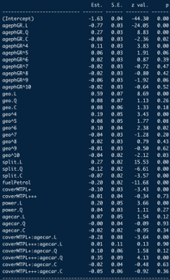
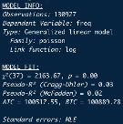
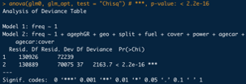

\newpage
\tableofcontents
\pagebreak

# Introduction

The goal of this report is to explain the model built to set a risk premium, calculated for each single policy holder. The goal of this report is to inform all stakeholders about the process that goes into price setting in an insurance context. Different characteristics of a policyholder will be taken into account, delivered in a dataset of 160 000+ observations. For each observation the following information about the policy holder or the car is noted: 

\begin{table}[h!]
  \begin{center}
    \label{tab:table2}
    \begin{tabular}{l|c} %
      variables & discription\\
      \hline
      freq & total number of claims during the period of exposure \\
      claimAm & total claim amount during the period of exposure \\
      expo & exposure, part of a full year that the policy holder is covered \\ 
      ageph &  age of the policy holder\\ 
      postal & postal code in Belgium where the policy holder lives \\
      agecar & age of the car\\
      sexph & gender of the policy holder\\
      fuel & type of fuel of car \\
      split & splitting of the premium payments or not (once, twice, thrice, monthly) \\
      use & use of the car (private, professional) \\
      fleet & car belonging to a fleet (yes, no) \\
      sportc & sportscar or not (yes, no) \\ 
      cover & type of cover (MTPL, MTPL+, MTPL+++)\\
      power & power of the car (< 66, 66-110, > 110)\\
    \end{tabular}
    \caption{variables}
  \end{center}
\end{table}

This dataset combined with a dataset containing spatial data about each city in Belgium will constitute to the foundations of modeling the risk premium for each policy holder. Different steps are needed to make a well performing pricing model. To start, raw data should be processed to make it usable for modeling. Then, use the processed data to get a first idea for the data and possible its distributional quantities. Further, the gained knowledge is used to model frequency (claim count) and severity (claim amount) individually with different models. To set a technical premium, the best model for each aspect is chosen and applied to the data to make predictions for each policy holder. multiplying both predictions yield the technical premium. To end, a certain quantitatively determined safety loading is added to the technical premium, which then gives the risk premium. Obviously, this will not immediately equal the commercial premium which will actually be charged to policy holders, but this step is left for another department specialized in the commercial aspect of insurance. 

## Binning of Spatial Data 
Spatial data was represented as a pair of longitude and latitude coordinates in the dataset. These correspond to the center of each of the Belgian regions. In this way they could be linked to the postal codes, which is a known variable for each policy holder in the dataset. This allows us to make predictions of the claim frequency and claim severity based on the general region that a policy holder lives in. Then, based on these predictions the postal codes can be binned in an optimal number of factors. 

To start, a model to estimate the predicted frequency needs to be constructed. A Generalized Additive Model (GAM) will be used for this purpose. A base model to model spatial data is $y \sim s(long, lat, bs=”tp”)$. Note that a smoother was used for longitude and latitude coordinates, which makes us able to see regions with higher, repectively lower, expected claim frequency. If only postal codes were used, these regional effect would not be visible and all cities would be seen as independent of their location with respect to each other. 

We use a Poisson-family with a log-link function which is a logical choice when modeling claim frequency in an insurance context. Also, the exposure needs to be added as an offset due to a not all policy holders being covered for a full year and due to modifications (eg. people that move change their postal code or people that buy a more powerful car). The spatial model is then extended with several other variables. By comparing the log-likelihood and the Akaiki Information Criterion (AIC) of different GAM-models, the most optimal GAM for frequency data was found: $freq \sim s(ageph) + s(long,lat) + power + cover + fleet + split  + fuel + sexph + agecar$. Also, this model was constructed with a Restricted Maximum Likelihood (REML), while still applying the offset and the same family and link function. 

The model was then used to predict the expected claim frequency. On a continuous scale, this would yield results presented in the figure \ref{fig:unbinned spatial GAM}:

\begin{figure}[h!]
  \centering
  \includegraphics[width=0.60\linewidth]{Frequency_Analysis/Final documents/Text/CopyOfF1 - Claim frequency data - UNBINNED spatial.png}
  \caption{Unbinned spatial GAM}
  \label{fig:unbinned spatial GAM}
\end{figure}
\newpage

Linking each policy holder’s postal code to its predicted frequency, makes us able to bin the continuous variable using Fisher’s method. This method bins based on the steepness of the cumulative distribution function of the predicted values. A steeper cdf means more breaks, while a flatter cdf means less breaks, as show in figure 2a.

A follow-up problem of binning is choosing the optimal number of bins over which the observations need to be distributed. By comparing the BIC's of models with 2 to 20 bins. This yields a factor variable that approximates the continuous spatial variables. The factor variable is added to the dataset to be used in further modeling (see figure \ref{fig:binning geo}).

\begin{figure}[h!]
  \centering 
  \begin{subfigure}{0.5\textwidth}
    \centering
    \includegraphics[width=\linewidth]{Frequency_Analysis/Final documents/Text/F2.png}
    \caption{Fisher frequency binning}
    \label{fig:1}
    \end{subfigure}%
\begin{subfigure}{.5\textwidth}
  \centering
  \includegraphics[width=\linewidth]{Frequency_Analysis/Final documents/Text/F3.png}
  \caption{Binned spatial map}
  \label{fig:sub2}
\end{subfigure}
\caption{Binning spatial variable}
\label{fig:binning geo}
\end{figure}

The constructed regions for frequency data, were reused for the severity data. This was done for two main reasons. The first being that severity applies a whole different dataset where only non-zero claims were observed. By streamlining the use of the same dataset, mistakes and difficulties can be avoided. Besides this, it was tested to use severity data to bin the spatial effect, but this gave very unlogical and unexplainable bins which would only further complicate the model due to very significant deviations from frequency-binned variables.
A last argument in favor of not making a distinction will be made further into the paper where a dendogram is constructed. This yields quantitative proof of the close correlation between frequency and severity. Because this research strives for the most parsimonious model, this added complexity was dropped, while still maintaining more than sufficient accuracy and performance of the model. 
\newpage

## Binning of Age Variable 

In the dataset used to price our insurance products, age is recorded as a continuous variable with ages ranging from 17 to 95 years old. To optimally use a Generalized Linear Model GLM, it is advised to use only categorical variables, and thus age is best converted to an ordered factor variable.

For claim frequency, the GAM used for the binning of spatial data was reused, but with the binned version of the spatial data as a replacement for its continuous counterpart, all other aspects identical. Thus, the used formula is: $freq \sim s(ageph) + geo + power + cover + fleet + split + fuel + sexph + agecar$, with ‘geo’ being the binned spatial variable. A new dataset was constructed (GAM_data) with a frequency prediction for every value of age and their observed count in the training dataset. This is possible because ‘age’ is not really a continuous variable, it can only take positive integer values. In this new dataset, the coefficient of the smoother of ‘age’ is also included. Based on GAM_data, the evtree( )-function in R can be used to construct a regression tree based on an evolutionary algorithm and with the counts per age as weights. In this R-function, it is useful to include an evtree.control( ), which controls the complexity of the constructed tree. 4 Parameters were used for this goal, with the first being the alpha, which was set to 100 to penalize complexity. Also, the maximum depth of the tree was set to 5 to limit the size of the tree. The two last control parameters were set to control the choice wether to split or not. ‘minbucket’ Sets the minimum sum of weights in a terminal note, here set to 5% of the total weights in the training set. ‘minsplit’ Determines the needed minimum sum of weights in a node to consider a split, here set to 10% of the total weights in the training set. 

The constructed tree yields the following breakpoints: 17, 26, 29, 32, 35, 38, 51, 55, 59, 63, 73, 95, which makes for 11 bins. This tree has been plotted in figure \ref{fig:binning ageph}. 

\begin{figure}[h!]
\centering
  \includegraphics[width=0.8\linewidth]{Frequency_Analysis/Final documents/Text/F4.png}
  \caption{Binning age variable }
  \label{fig:binning ageph}
\end{figure}

\newpage

Clearly, the differences in expected claim frequency per bin can be seen in the boxplots below each bin in the tree. Policy holders younger than 26yo have a higher expected claim frequency compared to for example a 55yo policy holder. The binned variable is added to the original dataset under ‘agephGR’. 

Again, the same reasoning can be applied for severity. As for the binning of the spatial variables, the binning of the age variable was also only done for the frequency dataset for the same reasons as stated before. As an example of an irregularity note that the variables 'age' in severity data only ranges from 18 to 92. This means there are no observations of non-zero claims for 17yo policy holders nor for 93-95yo policyholders, despite the fact that there are policy holders in the datasets with these ages. A naive approach would be to just add these people to the bottom and top bins respectively. A more quantitative approach, which is used here, is to just use the bins based on frequency data. This approach forgoes the stated irregularities and inaccuracies explained above. 

## Exploratory Analysis 

Before the technical tariff structure can be constructed, an exploratory analysis of the given data has to be executed to get a first glance of the structure and characteristics of the dataset. The exploratory analysis will be split up in two parts. The first part will explore the data for the frequency information and the second part will explore the data for the severity information. 

### Frequency

To get a feel for the data, some basic R-functions (str, names, head, summary) are used on the original dataset and the sampled training set. These are mostly done to get a feel for the data and possibly some distributional hints. Only some variables where you may expect another type, like the variables long, lat where you could expect type long instead of chr. This should be kept in mind when using these variables. After inspecting the data, the variables 'lnexpo' and 'freq_ann' are removed from the dataset. They were considered redundant, because they could easily be reproduced with other variables in the dataset. 

To obtain further understanding of the dataset, a grid of relative frequency plots is constructed based on the training data (figure\ref{fig:frequency}) . Some interesting points can be noted from observing these graphs. A first example was the number of claims: most policy holders report zero claims, while almost no policy holders report more than 2 claims over the exposed period. Exposure too, has an interesting shape: most people are covered for a full year. Values below one for exposure seem to be about uniformely distributed. Most policy holders have minimal coverage (MTPL) and only few have the maximum coverage offered (MTPL+++). Also, most policy holders drive weaker vehicles with less than 66 horsepower. Lastly, but probably most importantly, note the very uneven distributions for 'use', 'fleet', 'sportc'. This will have an effect on modeling discussed further into the paper. 

\begin{figure}[h!]
  \includegraphics[width=\linewidth]{Frequency_Analysis/Final documents/Exploratory/Exploratory - relative Frequency.png}
  \caption{relative frequency}
  \label{fig:frequency}
\end{figure}

To make sure the training dataset is a good sample for the full datasetfull dataset, the empirical frequency of all variables is compared between both. The empirical mean and variance of claim frequency are very comparable across the full and training dataset respectively. The same comparison was made for all other variables which let us to the conclusion that the sampled training set indeed is a good representation of the actual dataset. 

\newpage
### Severity 

We start the exploratory analysis on severity by looking at the density of logarithmic claim amounts (see figure \ref{fig:severity exploratory}). From this, we can clearly see that the data is not following any well-behaved distribution and we thus opt to use the Gamma distribution as this is more versatile and flexible compared to another often used distribution for such problems: log-normal distribution. From the graph we can also deduce that there are a lot of outliers, which is expected for claim amounts as they tend to deviate from the mean. Next, the mean, variance, skewness and kurtosis are 1866.57, 19338.67, 78.84, 7701.894 respectively. This also indicates a lot of deviation on the positive side and frequent outliers as the kurtosis is substantial. This result also emphasizes the conclusion we made from the figure. The figure \ref{fig:map} is a representation of the relative claim amounts per region where we subdivide the claim amounts per region according to the following quantiles: 0.2, 0.8 , 0.9, 0.95 and 0.99. From the map of Belgium we observe that most of the claim amounts occur in cities like Brussels, Antwerp and Liege. Although, there are some regions with a sizable claim amount. For example a region of approximatly the Hainaut Province., for example in the Hainaut Province. This could indicate that some outliers might be located in these regions. 

\begin{figure}[h!]
  \centering 
  \begin{subfigure}{0.5\textwidth}
    \centering
    \includegraphics[width=\linewidth]{Severity_Analysis/plots/exploratory/density.png }
    \caption{density of claim amount}
    \label{fig:1}
    \end{subfigure}%
\begin{subfigure}{.5\textwidth}
  \centering
  \includegraphics[width=\linewidth]{Severity_Analysis/plots/exploratory/county.png}
  \caption{claim amount per region}
  \label{fig:map}
\end{subfigure}
\caption{exploratory analysis of severity}
\label{fig:severity exploratory}
\end{figure}
 

Now that the claim amounts have been plotted according to the postal codes, we can subsequently plot the claim amounts based on the other independent variables (see figure \ref{fig:boxplot}). Here it is clearly visible that there are some variables  which give a hint of being redundant and thus have less explanatory power than the others. For example the variables 'use', 'fleet' and 'sportc' are highly homogeneous and likely not able to explain a lot of the variation in our dependent variable. Also, the variables 'sexph', 'fuel' and 'power' do not have a visible impact on claim amounts. On the other hand, the variables 'agecar', 'cover', 'split' and the binned version of 'ageph' create a detectable change in the claim amounts and will thus be more likely to explain part of our dependent variable. Note that most outlier (claims with massive claim amounts) can be observed for males, for cars aged six to ten years, for policyholders between 38 and 51yo, for policy holders that do not split their premium payment and for policy holders with minimal cover (MTPL). But we also need to be careful with such conclusions as this is also the largest subgroup in the population and might as well just posses these outliers in proportion. 

\begin{figure}
  \includegraphics[width=\linewidth]{Severity_Analysis/plots/exploratory/barplots.png}
  \caption{boxplots: log claim amount and factor variables }
  \label{fig:boxplot}
\end{figure}

\newpage

## Interaction Effects

Now that we have looked at the independent variables with respect to the dependent variable we want to have a closer look at the interaction effects between the independent variables. To do this we follow the paper of @chavent2011clustofvar. They measured the homogeneity between variables by looking at the squared Pearson correlation $r^2$  and the correlation ratio $\eta^2$ between the variables. They defined the homogeneity of a cluster of variables $C_k$ as: 

$$ H(C_k) = \sum_{x_j \in C_k} r^2_{x_j,y_k} + \sum_{z_j \in  C_k} \eta_{y_k|z_j} = \lambda^k$$
Where $x_j$ are the quantitative variables,  $z_j$ are the qualitative variables and $y_k$ is the first principle component (PCA) of the cluster (the synthetic variable of the cluster). Then, @chavent2011clustofvar devised an algorithm which chooses the partition which maximizes the homogeneity of the cluster. This is done in nested approach giving us the dendogram in figure \ref{fig:dendogram}. 

Clearly, ‘sportc’ and ‘power’ are closely linked, which can perfectly be explained by the logic that sportscars mostly have a more powerful engine. Also, the stronger correlation between the age of the car and the type of cover can be explained: most newer cars have an MTPL-coverage, while older cars tend to go for MTPL+ or MTPL+++. Next, the link between ‘use’ and ‘fleet’ can be explained by the fact that most professional-use cars are company cars which are part of a fleet. Lastly, an interaction between the age of the policyholder and the payment method (‘split’) is studied based on the logic that younger people prefer to split their premium payments due to them having less money to spend compared to older people (see figure \ref{fig:ageph-split}). Although, looking at the graph, this relation is not observable in the data. Note that our dependent variable is also included and we can already see which variables might be important in explaining the claim size. For claim amount 'ageph' , 'split' and 'geo' will probably have an significant impact.

\begin{figure}
  \includegraphics[width=\linewidth]{Severity_Analysis/plots/exploratory/dendogram.png}
  \caption{dendogram: relations between variables}
  \label{fig:dendogram}
\end{figure}

\begin{figure}
  \includegraphics[width=\linewidth]{Frequency_Analysis/Final documents/GLM/Relation agephGR - split kopie.png}
  \caption{relation between the age of the policy holder and the split of the premium}
  \label{fig:ageph-split}
\end{figure}

\newpage

# Model Building 

## Frequency 

Frequency analysis will be done using two models: on the one hand a Generalized Linear Model and on the other hand a Gradient Boosting Machine. Both will be compared whether they have sufficient predictive power, given their complexity. The final model will be chosen based on the higher accuracy on unseen data, while maintaining a model as simple as possible. Note that a GLM is much simpler compared to a GBM, but is a lot less flexible.

### Generalized Linear Model (GLM)

A GLM was chosen because it is one of the most interpretable models of all possible models, which is very important when explainability is an important factor as it is in the insurance industry. A simple model is easy to explain to the legislator and other stakeholders who may not be an expert in this field. As already mentioned, a GLM is not the most flexible model with respect to other models. It requires linear relations and is preferably modelled with categorical independent variables. Because of this the spatial variable and the variable of the age of the policyholder were binned into two factor variables, as discussed earlier. 

To find the optimal GLM, the simplest possible model was used as a starting point: freq ~ 1. Because Poisson is a good distribution for frequency data, the Poisson family was used when constructing GLM’s with the logarithm of exposure as an offset to correct for non-full years of coverage.An alternative appraoch could be to replace the Poisson distribution by a Negative Binomial. On this base case, other variables were added one by one and their drop in deviance was compared. The added variable which constituted the biggest drop in deviance, given this drop was significant compared to a Chisq. critical value, was kept. Once all singular variables were exhausted, interaction terms were considered, limited to two-way interactions. Not all possible interactions were tested due to computational cost contraints, but only the logical ones and the ones based on a dendogram (see Interaction Effects). 

In the added Excel-file (tab ‘GLM’), the reader can follow and compare all the added variables in each step. As an example, the first box is given in figure \ref{fig:GLM results} which is used to find the first variable to add to the model. The first line is the base case (glm0), respresented by the formula $freq \sim 1$ , with a deviance of 72 239 and 130 926 degrees of freedom. Each line in the second box represents a different added variable. Every model has its own deviance and degrees of freedom. By comparing these with the base case, the model with the biggest drop in deviance can easily be selected. In this case adding ‘agephGR’ gives the biggest significant drop in deviance, while ‘use’ gives the smallest. The p-values of each added variable were calculated using the Chi-squared distribution. Following these findings, the model to proceed with is $freq \sim  1 + agephGR$, which will be used as the new base case for adding a second variable. Following iterations can be consulted in the added Excel-file which gives a convenient and full overview of the tested and selected models.

\begin{figure}
\centering
  \includegraphics[width=\linewidth]{Frequency_Analysis/Final documents/Text/F7.png}
  \caption{screenshot results GLM}
  \label{fig:GLM results}
\end{figure}

\newpage

Applying this method repeatedly, it can be shown that the most optimal GLM, given the observed training dataset is: 
$$ freq  \sim 1 + agephGR + geo + split + fuel + cover + power + agecar + agecar:cover  $$

As a last check whether the aded variables are indeed significant and meaningful, the optimal GLM is compared to the initial base case (glm0). The output below (anova with Chi-squared test) shows a drop in deviance of 2163,7, a difference of 37 degrees of freedom which lead to a p-value small enough to make almost-certain conclusions (***). (see appendix for output optimal GLM)

### Gradient Boosting Machine (GBM)

A second approach to modelling frequency data, was by applying a Gradient Boosting Machine. Gradient Boosting is a machine learning technique for regression and classification problems to build a predictive model as an ensemble of weak predictive models. It builds sequential models, in contrast to random forest which builds in parallel, and optimizes an arbitrary differentiable loss function (@hastie2009elements). The differentiable loss function is the Poisson deviance for this application, due to it being used widely when modelling claim frequency. In short, GBM combines weak learners into a single strong learner in an iterative way. By doing this, the model becomes rather flexibel compared to simpler models as a GLM. But this approach has a much lower interpretability and explainability (see figure \ref{fig:int-flex}). Just imagine having to provide every tree in the sequence to explain why a certain prediction comes about. Obviously, this is much harder than just offering a Least Squares model that can be interpreted by almost anyone with basic statistical knowledge.

\begin{figure}
\centering
  \includegraphics[width=0.5\linewidth]{Frequency_Analysis/Final documents/Text/F10.png}
  \caption{Interpretability and flexibility}
  \label{fig:int-flex}
\end{figure}

\newpage 

Gradient Boosting has two tuning paramters which need to be optimized. On the one hand the number of sequential trees (n.trees, T) needs to be determined, and on the other hand the interaction depth (interaction.depth, d) needs to be determined. T is rather self explanatory in the sense that more trees make for a complexer, but a more flexible model. The interaction depth might need some added explanation. When d is 1, an additive model is made. When d is 2, the algorithm allows up to two-way interaction. Also, note that when d increases, the complexity of the model will also increases and consequently the computational cost.

Besides tuning parameters, also two hyperparameters need a value assigned to them. Firstly, a shrinkage paramter $(0< \lambda <1)$ needs to be assigned, which determines the learning rate or step-size reduction of each iterative tree. Assigning a higher value to this parameter will result in better performance, but will also increase the number of trees and thus increase the computational time. For this application, a value of 0.01 is used based on the finding of @henckaerts2020boosting . The second hyperparameter also is based on the finding of this same paper, namely the bag fraction $(0< \delta<1)$, which gets the value 0.75 assigned to it. This means that in each iteration 75% of the training set is randomly selected and used to determine the following step. By introducing randomness, it is usefull to set a seed in R so that the results can be reproduced. Another choice that has to be made before modelling is the number of folds in the cross-validation (cv) of the GBM. Tests have been conducted with cv set to 5 and 10, but the added computational cost of a 10-fold cross-validation was not worth the marginal gain in accuracy. Because of this reason a 5-fold CV was deemed to be sufficient. Lastly, there was opted to set the minimum amount of observations in a terminal node equal to 10 000 to set a certain constrain on the size and complexity of the model. 

The results for different values of ‘interaction.depth’ and ‘n.trees’ were conventiently summarized in figure \ref{fig: results GBM}, but can also be conculted in the added Excel-file. To optimize the numbers of iterative trees two methods were used. First the out-of-bag estimate was calculated and secondly cross-validation was used. Although the OOB-method gives a warning of underestimation in R, there was opted to proceed using the findings of this method. 

Note in the table that an increase of the interaction depth from d = 2 to d = 3 does not significantly decrease the training error, while this change increases the complexity by quite a bit. The training error is calculated on the last iteration in the model, being the value of n.trees. Comparing the values of OOB n.trees for d = 2 and cv = 5, yields an optimal GBM with d = 2 and n.trees = 681 as shown in figure \ref{fig:deviance} of the Poisson deviance and in figure \ref{fig:OOB GBM} the OOB changes in this deviance.

\begin{figure}[h!]
  \centering 
  \begin{subfigure}{0.5\textwidth}
    \centering
    \includegraphics[width=\linewidth]{Frequency_Analysis/Final documents/Text/F10 - Screenshot Excel GBM.png}
    \caption{Results GBM}
    \label{fig: results GBM}
    \end{subfigure}%
\begin{subfigure}{.5\textwidth}
  \centering
  \includegraphics[width=\linewidth]{Frequency_Analysis/Final documents/Text/F12 - Poisson Deviance GBM_perf.png}
  \caption{Poisson deviance}
  \label{fig:deviance}
\end{subfigure}
\caption{The results and deviance}
\label{fig:test}
\end{figure}

\begin{figure}[h!]
  \includegraphics[width=0.75\linewidth]{Frequency_Analysis/Final documents/Text/F13 - OOB Changes in Poisson Deviance - GBM_perf.png}
  \caption{OOB changes in poisson deviance}
  \label{fig:OOB GBM}
\end{figure}

Using the optimal Gradient Boosted model (gbm_perf), partial dependence plots (PDP) can be constructed. These depict the functional relationship between an input variable and the predictions and they show how predictions depend on these inputs individually. In this way the relevance of different input varaibles can be determined. The PDP’s of all individual variables of the optimal GBM are tabulated below. From figures \ref{fig:pdp geo}, \ref{fig:VI GBM} and \ref{fig:pdp}, it is clear that ‘geo’, ‘ageph’, ’agecar’, ’sexph’, ’fuel’, ’split’, ’cover’ and ‘power’ have a significant influence on the predictions made. In contrast, ‘use’, ‘fleet’ and ‘sportc’ do not have this important role when predicting claim frequency.  Although a certain comment has to be made with respect to these last three variables. When looking at the relative frequency of these three variables, it is clear that there were only very few observations of sportscars, professional use cars and cars that were part of a fleet. This could be a (partial) explanation of the findings of an insignificant influence. 

\begin{figure}[h!]
  \includegraphics[width=\linewidth]{Frequency_Analysis/Final documents/Text/F14 - summary gbm_perf.png}
  \caption{variable importance }
  \label{fig:VI GBM}
\end{figure}

\begin{figure}
  \includegraphics[width=\linewidth]{Frequency_Analysis/Final documents/Text/F15 - Partial Dependency Plot - GBM - geo.png}
  \caption{Partial dependency plot 'geo'}
  \label{fig:pdp geo}
\end{figure}

\begin{figure}
  \includegraphics[width=\linewidth]{Frequency_Analysis/Final documents/Text/F16 - Partial Dependency Plots - GBM.png}
  \caption{pdp other variables}
  \label{fig:pdp}
\end{figure}

\newpage 

### Conclusion 

Two models were contructed and optimized, a GLM on the one hand and a GBM on the other hand. Both of these models serve as a predictive models for claim frequency, and both yield satisfactory results. Although, one of both has to be chosen. This choice will be based on predictive power and complexity of the model. In this stage the test set will be put to use, which is the dataset with unseen data for both models. Based on the predictive power on this set, the right model will be chosen. Predictive power is measured with the Root Mean Squared Error (RMSE) and the calculations are shown below.

$$RMSE = \sqrt{\frac{1}{n}\sum(\hat y_i - y_i)^2} $$

\begin{table}[h!]
  \begin{center}
    \label{tab:table1}
    \begin{tabular}{l|c|r} %
      model & training set & test set \\
      \hline
      Generalized Linear Model & 0,1331316 & 0,1319949\\
      Gradient Boosting Model & 0,1333529 & 0,1320059\\
    \end{tabular}
    \caption{Root Mean Square Error}
  \end{center}
\end{table}

Notice that the RMSE of the test set is comparable for both models with only marginal differences. With these findings in mind, there can be concluded that the optimal GLM is the model to use. This because the RMSE’s are so close to each other that the added complexity of the optimal GBM just is not worth it. As a conclusion of frequency modeling, the final model will be repeated below:

\begin{table}[h!]
  \begin{center}
    \label{tab:table2}
    \begin{tabular}{l|c} %
      model & Generalized Linear Model\\
      \hline
      family & Poisson\\
      offset & log(exposure)\\
      \hline 
      formula & $\begin{array} {lcl} freq \sim 1 + agephGR + geo + split + fuel + cover + \\ power + agecar + agecar:cover \end{array}$ \\
    \end{tabular}
    \caption{chosen model}
  \end{center}
\end{table}

## Severity 
For modeling the severity, we opt for a GLM and a Random Forest. This choice is based on the fact that GLMs are still the most interpretable models currently available and thus a good way to give meaning to the results. The Random Forest was chosen because they require no fine tuning like GBM and are thus less susceptible to overfitting, which in the severity case is important to avoid. 
 
### Generlized Linear Model 

The most important aspect of fitting the correct model with a GLM is including the right covariates. To do this we follow @calcagno2010glmulti, which have build an R-package for variable selection in GLM models. The package of @calcagno2010glmulti is a wrapper around the GLM function. It does variable selection in two ways: fitting all models and a genetic algorithm approach. In our case, the first option is used. As the name of the method explains, we will fit all possible models and then select the best model based on an information criteria. We will only allow the interaction effect seen in dendogram at height one (see exploratory analysis), so that the comparison between models is manageable. Two exception are made: the interaction effect of 'group_ageph'^['group_ageph' and 'agephGR' are the same variable] with 'geo' and 'group_ageph' with 'split' as these are more closely related to the dependent variable in the dendogram. This gives us a total of 8125 possible models to compare with. Two information criteria will be used to select the best model: Aikake Information Criteria (AIC) and Bayesian Information Criteria (BIC). The Gamma distribution with a log link is chosen for modeling the claim amount in the GLM. The AIC and BIC are also calculated with the loglikelihood of the Gamma distribution as we model the GLM with the Gamma distribution. The results of the variable selection procedure can be found in the following graphs and will be discussed in the next paragraphs. 

In figure \ref{fig:best models}, the two Information Ciriteria (IC) profiles are plotted of each model. The horizontal line is according to @calcagno2010glmulti a rule of thumb to indicate which models are worth considering as optimal model. For the AIC there are three potential models, while for the BIC there is only one optimal model.

\begin{figure}[h!]
  \centering 
  \begin{subfigure}{0.5\textwidth}
    \centering
    \includegraphics[width=\linewidth]{Severity_Analysis/plots/GLM/AIC/best_models.png}
    \caption{AIC}
    \label{fig: AIC best model}
    \end{subfigure}%
\begin{subfigure}{.5\textwidth}
  \centering
  \includegraphics[width=\linewidth]{Severity_Analysis/plots/GLM/BIC/best_model.png}
  \caption{BIC}
  \label{fig:BIC best model}
\end{subfigure}
\caption{Best 100 models of 8125 possible models}
\label{fig:best models}
\end{figure}

Figure \ref{fig:RREW} plots the Ranked Relative Evidence Weight (RREW) of the models for the two IC: $exp(\frac{-\Delta IC}{2})$ . Where $\Delta IC$ is the difference between a model and the best model. The RREW is subsequently normalized and then plotted. The interpretation of the RREW is the following: the RREW is the probability of a model being the optimal model in the set. The red vertical line indicates the 95% quantile of the cumulated evidence weight. For the AIC there are three possible models which could be the optimal model. Similarly, for the BIC there are also three possible models. Although the last model can be neglectable due to a low RREW value. 

\begin{figure}[h!]
  \centering 
  \begin{subfigure}{0.5\textwidth}
    \centering
    \includegraphics[width=\linewidth]{Severity_Analysis/plots/GLM/AIC/evidence_weight.png}
    \caption{AIC}
    \label{fig:AIC weight}
    \end{subfigure}%
\begin{subfigure}{.5\textwidth}
  \centering
  \includegraphics[width=\linewidth]{Severity_Analysis/plots/GLM/BIC/evidence_weight.png}
  \caption{BIC}
  \label{fig:BIC weight}
\end{subfigure}
\caption{Ranked Relative Evidence Weight (RREW)}
\label{fig:RREW}
\end{figure}

Figure \ref{fig:VI GLM} shows estimated importance of each variable, computed as the sum of the relative evidence weights of all models in which the variable appears. It is noticeable that the BIC selects fewer variables than the AIC, but by doing so it disregards important variables like 'group_age'. This might indicate that AIC is the preferable IC for our analysis. 

\begin{figure}[h!]
  \centering 
  \begin{subfigure}{0.5\textwidth}
    \centering
    \includegraphics[width=\linewidth]{Severity_Analysis/plots/GLM/AIC/variable_importance.png}
    \caption{AIC}
    \label{fig:AIC VI}
    \end{subfigure}%
\begin{subfigure}{.5\textwidth}
  \centering
  \includegraphics[width=\linewidth]{Severity_Analysis/plots/GLM/BIC/variable_selection.png}
  \caption{BIC}
  \label{fig:AIC CI}
\end{subfigure}
\caption{Variable importance (VI)}
\label{fig:VI GLM}
\end{figure}

\newpage

The following optimal models based on the variables selection are :

Aikake Information Criteria: 

\begin{enumerate}
  \item $ \begin{array} {lcl} claimAm \sim group_{}ageph + agecar +  sexph + fuel + split + use +
        fleet + \\cover + power +  geo + fuel:sexph +   split:group_{}ageph + fleet:use +\\ cover:agecar \end{array}$
        
  \item $ \begin{array} {lcl} claimAm \sim group_{}ageph + agecar + sexph + fuel + split + use +
        fleet \\ + sportc + cover +   power + geo + fuel:sexph + split:group_{}ageph + 
        \\fleet:use + cover:agecar + power:sportc \end{array}$
  \item $ \begin{array} {lcl}claimAm \sim group_{}ageph + agecar + sexph + fuel + split + use +
        fleet + \\ sportc + cover + + power + geo + fuel:sexph + split:group_{}ageph + fleet:use + \\cover:agecar \end{array}$
\end{enumerate}

Bayesian Information Criteria: 

\begin{enumerate}
\item $ \begin{array} {lcl} claimAm \sim agecar + fuel + split + use + fleet + cover + power +
    geo + fleet:use + \\cover:agecar + geo:split \end{array} $
\end{enumerate}
The final model we chose was the first model of AIC without the interaction effect
'sexph:fuel'. We did not include this interactions effects because it did not make any practical sense and it was not important in the BIC analysis. 

### Random Forest 
The last model used is the Random Forest (RF) model. The general concept of RF is that you build a substantial amount of base learners (here gamma regression trees) on a bootstrapped sample and their predictions are combined. This approach helps avoid overfitting and it reduces variance. The dominant variables in the dataset can cause tree correlation. Therefore,  the RF only selects from a subset of variables at each split and by doing so it avoids tree correlation and further decreases the variance. 

The model is implemented with the package distRforest, which is based on the rpart package. DistRforest builds a Gamma regression forest with the following model specification. The model is built with 500 trees, five randomly chosen variable candidates at each split, a maximum depth of five nodes for each tree, a splitting criteria of twenty observation in the existing node and each terminal node needs to have at least twenty observations. All trees use a subsample of 80% to construct the Gamma regression. The formula used is: $claimAm \sim ageph + agecar + sexph + fuel + split + use + fleet + sportc + cover + power + geo$ . Note that the continuous counterpart of the binned 'ageph' is implemented. In figure \ref{fig:RF} the out-of-bag (OOB) errors and the variable importance are plotted. from this figure we can infer that the errors quickly stabilize after 100 trees and that the most important variables are 'ageph', 'split' and 'agecar'. Unfortunately, the partial differential plots could not be made from RF as the distRforest package is not yet compatible with the pdp package in R.

\begin{figure}[h!]
  \centering 
  \begin{subfigure}{0.5\textwidth}
    \centering
    \includegraphics[width=\linewidth]{Severity_Analysis/plots/RandomForest/OOB.png}
    \caption{OOB of Random Forest}
    \label{fig:1}
    \end{subfigure}%
\begin{subfigure}{.5\textwidth}
  \centering
  \includegraphics[width=\linewidth]{Severity_Analysis/plots/RandomForest/importance.png}
  \caption{Variable Imprtance of Random Forest}
  \label{fig:sub2}
\end{subfigure}
\caption{analysis Random Forest}
\label{fig:RF}
\end{figure}
\newpage

### Conclusion 
As a conclusion, one of both models should be chosen as the optimal one to predict claim amounts for new policies. This is done by comparing the RMSE for the optimal Generalized Linear Models and the optimal Random Forest.: 

$$RMSE = \sqrt{\frac{1}{n}\sum(\hat y_i - y_i)^2} $$

\begin{table}[h!]
  \begin{center}
    \label{tab:table3}
    \begin{tabular}{l|c|r} %
      model & training set & test set \\
      \hline
      Generalized Linear Model & 18326.9 & 13551.58\\
      Random Forest & 17974.3 & 13581.56\\
    \end{tabular}
    \caption{Root Mean Square Error}
  \end{center}
\end{table}

From these results, we conclude that the RF preforms better on the train set than on the test set if we compare it to the GLM. We thus opted for the GLM as our final model: 

\begin{table}[h!]
  \begin{center}
    \label{tab:table2}
    \begin{tabular}{l|c} %
      model & Generalized Linear Model\\
      \hline
      family & Gamma\\
      \hline
      formula & $\begin{array} {lcl} claimAm \sim group_{}ageph + agecar + sexph + fuel + split + use + fleet\\ + cover + power +  geo + fuel:sexph + split:group_{}ageph + \\
    fleet:use + cover:agecar \end{array} $ \\
    \end{tabular}
    \caption{chosen model}
  \end{center}
\end{table}

# Loadings 

The risk premium of a policy can be split up in two main parts, a pure premium and a risk loading. The pure premium calculated in the previous parts of this paper, is used to pay the future losses of the policy. The risk loading which will be discussed in this part, has the purpose of covering excess future losses that are not covered by the pure premium (@yang2020risk). The most used approach for calculating the risk premium is by separately analysing the pure premium and the risk loading. Traditionally generalized Linear Models or GLMs are used for such analysis. Risk loadings can be derived in a traditional way by using the expected value premium principle or standard deviation premium principle (@yang2020risk). 

Expected value premium principle: $$ H(Y_i) = E(Y_i) + \phi E(Y_i) $$
Standard deviation premium principle: $$ H(Y_i) = E(Y_i) + \phi \sqrt{VAR(Y_i)} $$

GLMs are considered the industry standard (@baione2019individual) although there are some downsides. Traditional regression models often have to rely on assumptions  (@kudryavtsev2009using). According to Kudryavtsev the following problem can occur with GLMS: an inaccurate estimate of loss distribution may occur. This estimation of the loss distribution could be very different from the real one. It could be difficult to give larger weights to extreme values, thus making it difficult to work with loss distributions that have heavy tails. Working with a number of outliers in the sample and dependence structure of the data also could cause problems. 

From the previous part there can be concluded that traditional regression methods like GLMs are not always the ideal match for real world situations. Therefore there should be looked at some alternative approaches  (@kudryavtsev2009using). Kudryavtsev and Yang both propose a quantile regression method. But, because GLMs are well known and frequently used in actuarial sciences this will be used for calculation of the safety loading, while keeping in mind the criticism on such GLMs (@baione2019individual).

To calculate the risk loading, the risk loading parameters need to be determined. In practice, this has to be done in advance and can be performed in several ways. A first method is a top-down appraoch proposed by Buhlmann (bron). He relates premiums to stability criterion of portfolio risks and dividend requirements for capital invested in insurance operations (@frees2013actuarial). Another approach is the opposite, being the bottom-up approach. Here, the calculation is started on the individual level by calculating the risk premium for each policy with the expected value premium principle. Then, all risk premiums are put together to find the total risk premium of a portfolio, which can be used to determine the risk loading parameter by making sure that the total risk premium is sufficient to cover total expected losses (@yang2020risk).

The top down approach for calculating the risk loading parameters, suggested by Yang in the paper “Risk loadings in classification ratemaking” seems to be the best method. First the risk premium of the entire portfolio will be calculated by applying the bootstrap method. This enables the possibility to get the total risk premium at the collective level. The risk premiums of different tariff classes can then be calculated by GLMs or quantile regressions. As stated earlier this discussion will only focus on GLMs. 

For the calculation of the risk premium, the expected value premium principle will be used. This was chosen because it is easy to understand and calculate and is often used in actuarial practice  (@heras2018application). Before the expected value premium principle can be used, the risk loading parameter $\phi$ has to be calculated. To calculate $\phi$ the earlier mentioned top-down approach suggested by Yang is used. First a predictive distribution of the future losses of the policy is calculated by using a bootstrap with 2500 repetitions. Yang suggests to use 10000 iterations. Although, this would yield a computational costs too high for the purpose, which is why 2500 iterations were deemed sufficient. The bootstrap was ran over the pure premium which was calculated in the previous parts. These pure premiums are calculated with a two-part GLM regression. The 99.5% quantile of the predictive distribution of the bootstrap equals 36 214 173. The 99.5% quantile was used, because this is conform the Solvency II regulation (@yang2020risk). This 99.5% quantile and the sum of all pure premiums calculated in the previous part can then be used to calculate $\phi$ . 

\begin{figure}[h!]
  \includegraphics[width=\linewidth]{Rplot02.png}
  \caption{Histogram: predictive distribution of the future losses}
  \label{fig:histogram }
\end{figure}

\begin{figure}[h!]
  \includegraphics[width=\linewidth]{Rplot02.png}
  \caption{Histogram: predictive distribution of the future losses}
  \label{fig:histogram }
\end{figure}

$$ \phi  = \frac{C – \sum{E(Y_i)}}{\sum{E(Y_i)}} $$

$\phi$ Can then be inserted in in the expected value premium principle, so that the risk loading and total risk premium can be calculated for each individual policy. 

# Conclusion 

After thoroughly analysing the data, a model is build to predict the future losses. This model has a frequency and severity part. To model the frequency a GLM and GBM were constructed. Out of the GLM and GBM, the GLM was most suitable to model the frequency. Both the GLM and GBM were an equally good fit, but the GLM was less complex. To model the severity a GLM and Random Forest were used. The GLM preformed better on the testset than the Random Forest.  Thus the GLM was preferred to model the severity. These GLMs were then used to calculate a pure premium. On this pure premium a risk loading was added.  This risk loading was calculated using the expected value premium principle. A top down approach suggested by Yang was used to calculate the risk loading parameters.  

# Conclusion 

After thoroughly analysing the data, a model is build to predict the future losses. This model has a frequency and severity part. To model the frequency a GLM and GBM were constructed. Out of the GLM and GBM, the GLM was most suitable to model the frequency. Both the GLM and GBM were an equally good fit, but the GLM was less complex. To model the severity a GLM and Random Forest were used. The GLM preformed better on the trainset than the Random Forest.  Thus the GLM was preferred to model the severity. These GLMs were then used to calculate a pure premium. On this pure premium a risk loading was added.  This risk loading was calculated using the expected value premium principle. A top down approach suggest by Yang was used to calculate the risk loading parameters.  

# Appendix

## Output Optimal GLM -Frequency - 
{width=75%}
{width=25%}
{width=50%}
