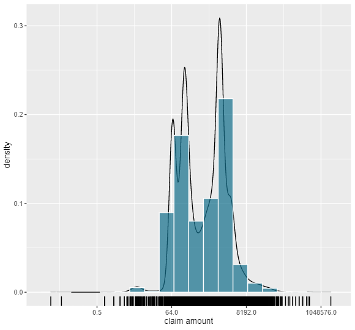
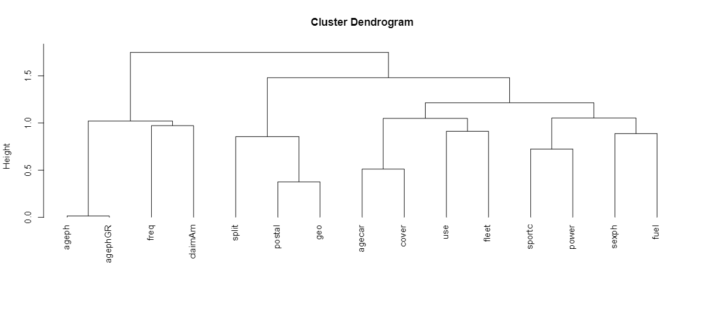

\tableofcontents
\pagebreak

# Introduction

# Exploratory Analysis 

## Frequency

## Severity 

we started the exploratory analysis on the severity by looking at the density of logarithmic claim amounts(See Figure \ref{density.png}). From the density we can clearly see that the data is not following any well-behaved distribution and we thus opted for using the gamma distributions as this distribution is more versatile than the log-normal. From the graph we can also deduct that there are a lot of outliers, which is expected for claim amounts as they tend to deviate from the mean. Next, the mean, variance, skewness and kurtosis are 1866.57, 19338.67, 78.84, 7701.894 respectively. This also indicated a lot of deviation on the positive side and frequent outliers as the kurtosis is substantial. This result also emphasize the conclusion we made from the graph. The following figure is a representation of the relative claim amounts per county where we subdivide the claim amounts per county according to the following quantiles: 0.2, 0.8 , 0.9, 0.95 and 0.99 .  From the map of Belgium we can say that most of the claim amounts occur in the cities like Brussels, Antwerp and Liege. Although, there are some counties where the claim amount is also a sizable amount, for example in the Hainaut Province. This probably indicates that some outliers might be located in these regions. 

{width=50%}
{width=50%}

Now that the claim amounts have been plotted according to the postal codes, we can subsequently plot the claim amounts based on the other independent variables. Here it is clearly visible that there are some variables which could be redundant and thus have less explanatory power than the others. For example the variables use, fleet and sport car are highly homogeneous and likely not able to explain a lot of the variation in our depended variable. Also, the variables sex, fuel and power do not have a visible impact on claim amounts. On the other hand, the variables age of the car, cover, split and the binned version of policy holders age create a detectable change in the claim amounts and will thus be more likely to explain our depend variable. Note, that the outliers are primarly located in cars with six to ten years of age from males between 38 and 51 having a one time split of the premium with a MTPL cover. But we also need to be carefull of this explaination as this is also the largest subgroup in the population and might as well just posses these outliers in proportion. 

{width=100%}

Now that we have looked at the 
following the paper of @chavent2011clustofvar

{width=75%}

# Model Building 

## frequency 

## severity 

# loadings 